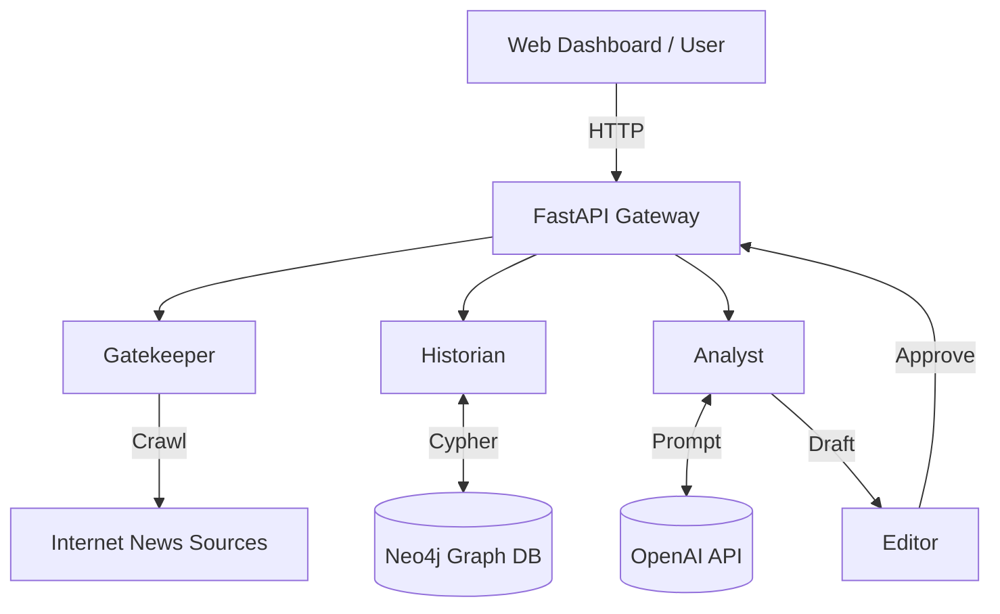

# Architecture Documentation

## System Overview

ACDT (Autowein's Cognitive Digital Twin) is designed as a **Provider-Based Modular Architecture**. Each phase of the cognitive process is encapsulated in a standalone module with clear interfaces.

## Key Technical Pillars
The system is built upon four advanced AI paradigms:
1.  **GraphRAG (Retrieval Augmented Generation)**: Instead of simple vector search, we use a Knowledge Graph (`Neo4j`) to retrieve structured, multi-hop context (e.g., "What led to this event?").
2.  **Inverse Reinforcement Learning (IRL)**: The system learns the "hidden reward function" of the human editor to continually improve its news selection criteria.
3.  **Multi-Agent Orchestration**: A specialized team of LLM agents (Planner, Simulator, Writer) collaborates to emulate the depth of human reasoning.
4.  **Supervised Fine-Tuning (SFT)**: We use Low-Rank Adaptation (LoRA) to finetune Llama-3/GPT models on 10 years of specific writing style data.

### 1. The Gatekeeper (Input Processing)
- **Role**: Selects "worthy" news from the noise.
- **Technology**: **Inverse Reinforcement Learning (IRL)**.
- **Data Acquisition**:
  - **Live**: `RealScraper` using `BeautifulSoup` to fetch fresh articles.
  - **Historical**: `NativeCrawler` (Reverse-engineered API) that ingested **23,365** articles (10 Years) from `autowein.com`.
- **Filtering**: `GatekeeperEngine` uses a learned reward model to rank news items.

### 2. The Historian (Memory & Context)
- **Role**: Provides long-term memory and context.
- **Technology**: **GraphRAG**.
- **Components**:
  - `Neo4jGraph`: Manages the graph database (Entities, Events, Relations).
  - **Retrieval**: Uses Cypher queries to find **Causal Paths** (Event A -> caused -> Event B) rather than just semantic similarity.

### 3. The Analyst (Reasoning Engine)
- **Role**: Synthesizes information into insight.
- **Technology**: **Multi-Agent System (MAS)**.
- **Workflow**:
  1. **Planner Agent**: Deconstructs the news element.
  2. **Simulator Agent**: Runs counterfactual reasoning ("What if this hadn't happened?").
  3. **Writer Agent**: Synthesizes the draft using the plan and simulation results.

### 4. The Editor (Quality Control)
- **Role**: Ensures high standards.
- **Components**:
  - `Critic Agent`: Scores drafts on Factuality, Insight, and Style.

### 5. Training & Fine-Tuning (The "Brain")
- **Role**: Clones the expert's cognitive style.
- **Data**: ~23k pairs of {Article -> Commentary} crawled from history.
- **Method**: Supervised Fine-Tuning (SFT) using `HuggingFace TRL`.
- **Infrastructure**: Dockerized training pipeline supporting Multi-GPU (RTX 3090).

## Domain Agnostic Design

The system is defined by its **Configuration** (`config.yaml`), not hardcoded logic.
- **Ontology**: Entity types and Event types are loaded dynamically.
- **Prompts**: Can be swapped to change the "Persona".

## Deployment Diagram

