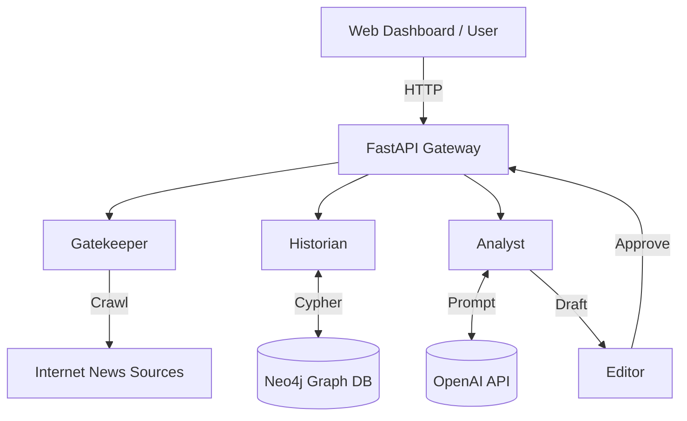

# Architecture Documentation

## System Overview

ACDT (Autowein's Cognitive Digital Twin) is designed as a **Provider-Based Modular Architecture**. Each phase of the cognitive process is encapsulated in a standalone module with clear interfaces.

### 1. The Gatekeeper (Input Processing)
- **Role**: Selects "worthy" news from the noise.
- **Components**:
  - `RealScraper`: Uses `newspaper3k` to crawl configured sources.
  - `GatekeeperEngine`: Applies `IRLScorer` (Inverse Reinforcement Learning) to rank news items against the user's preference history.

### 2. The Historian (Memory & Context)
- **Role**: Provides long-term memory.
- **Components**:
  - `Neo4jGraph`: Manages the graph database.
  - **Schema**:
    - `Entity`: Nodes representing Companies, People, Countries.
    - `Event`: Time-stamped nodes representing actions (e.g., "USMCA Signed").
    - `Relation`: Edges representing causality or involvement.
  - **Retrieval**: Uses Cypher queries to finding **Multi-hop Paths** (e.g., Event A -> caused -> Event B).

### 3. The Analyst (Reasoning Engine)
- **Role**: Synthesizes information into insight.
- **Workflow** (Linear Chain):
  1. **Planner Agent**: Reads News + History -> Outputs `Outline`.
  2. **Simulator Agent**: Reads News -> Outputs `Counterfactual Scenario`.
  3. **Writer Agent**: Reads Outline + Simulation -> Outputs `Draft`.
- **LLM**: Uses `OpenAI GPT-4o` with specialized System Prompts (`src/analyst/prompts.py`).

### 4. The Editor (Quality Control)
- **Role**: Ensures high standards.
- **Components**:
  - `Critic Agent`: Scores the draft on Factuality, Insight, and Style.
  - **Feedback Loop**: If score < Threshold, it triggers a rewrite (future work).

## Domain Agnostic Design

The system is defined by its **Configuration** (`config.yaml`), not hardcoded logic.
- **Ontology**: Entity types and Event types are loaded dynamically.
- **Prompts**: Can be swapped to change the "Persona".

## Deployment Diagram

