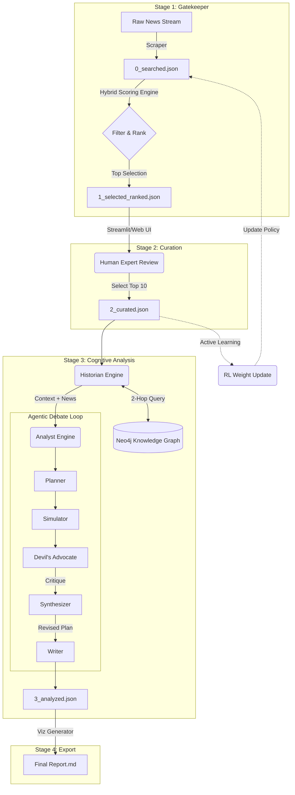

# Autowein: Cognitive Digital Twin for Mobility Intelligence

> **"An AI Analyst that Debates Itself to find the Truth."**

**Autowein** is an advanced AI intelligence system designed to monitor the global automotive industry, maintain a persistent Knowledge Graph, and employ Multi-Agent reasoning to generate strategic insights. Unlike simple news scrapers, it acts as a **Cognitive Digital Twin (CDT)** of a top-tier market analyst, using **Inverse Reinforcement Learning (IRL)** to filter noise and **Debate Protocols** to stress-test its own predictions.

---

## 🏛️ System Architecture

The system operates as a sequential 4-stage pipeline, orchestrated by either a CLI or a Web Dashboard.



### � Detailed Pipeline Workflow

Below is the step-by-step logic that executes within each stage.

#### **Stage 1: The Gatekeeper (Noise Filtering)**
**Goal**: Reduce 1,000+ daily noisy RSS items to ~50 high-value candidates.
1.  **Ingestion**: Scrapes Google News RSS for configured keywords (e.g., "EV", "Solid State Battery").
2.  **SBERT Embedding**: Converts titles and snippets into 768-dimensional dense vectors using `mpnet-base-v2`.
3.  **Hybrid Scoring Engine**: Calculates a composite score for every article:
    *   **Relevance (30%)**: TF-IDF keyword matching.
    *   **Semantic (40%)**: Cosine similarity to "Ideal Topic" clusters (using SBERT).
    *   **Preference (30%)**: **IRL Reward Model** score, trained on your historical curation choices.
4.  **Diversity Clustering**: Groups similar articles using **Levenshtein Distance** (text) and **Cosine Similarity** (meaning). Only the single highest-scoring article from each cluster survives, eliminating duplicates (e.g., 50 outlets reporting the same press release).

#### **Stage 2: Curation (Human-in-the-Loop)**
**Goal**: Align AI with human intent and generate training data.
1.  **UI Launch**: Presents the top ~50 candidates in the Admin Dashboard.
2.  **Selection**: The human expert toggles "Select" on the items that matter using intuition the AI might miss.
3.  **Feedback Loop**: The difference between "AI Proposed" and "Human Selected" is saved. This data helps the **IRL Model** in Stage 1 learn *your* specific taste over time (Active Learning).

#### **Stage 3: The Analyst (Cognitive Reasoning)**
**Goal**: Generate deep, causal strategic analysis.
1.  **Context Retrieval (The Historian)**:
    *   Extracts entities from the news (e.g., "BYD", "Hungary").
    *   **Graph-RAG**: Queries Neo4j for **2-Hop Connections** (`Match (e)-[*1..2]-(historical_event)`).
    *   *Result*: Finds hidden links (e.g., "BYD built a factory in Hungary 2 years ago" -> explains "Why Hungary supports BYD EU tariffs now").
2.  **Multi-Agent Debate Protocol (The Analyst)**:
    *   **Planner**: "We should analyze this as a supply chain disruption opportunity."
    *   **Simulator**: "Running counterfactual: What if this tariff never happened?"
    *   **Devil's Advocate**: "Critique: The Planner ignores the loop-hole in Article 4. The impact is overstated."
    *   **Synthesizer**: "Acknowledged. I will revise the plan to account for the Article 4 loophole."
    *   **Writer**: Drafts the final commentary based on the synthesized truth.

#### **Stage 4: Export (Visualization)**
**Goal**: Keep insights communicable and visual.
1.  **Metrics Parsing**: Extracts structured data (`Confidence Score`, `Time Horizon`) from the Agent's text output using Regex.
2.  **Mermaid Generation**: The LLM reads the analysis and generates code for a **Sequence Diagram** that visually maps the cause-and-effect chain.
3.  **Report Assembly**: Compiles the text, metadata badges, and rendered diagrams into a structured Markdown/HTML report.

---

## 🛠 Technology Stack

| Component | Technology | Reasoning |
| :--- | :--- | :--- |
| **LLM Core** | `Google Gemini 3 flash` | Huge context window (1M tokens) + Speed for debate loops. |
| **Embeddings** | `SBERT (mpnet-base-v2)` | Best-in-class open-source semantic search for filtering. |
| **Graph DB** | `Neo4j` | Necessary for modeling complex supply chains and relationships (Graph-RAG). |
| **Backend** | `FastAPI + Uvicorn` | Real-time log streaming and process management for the dashboard. |
| **Frontend** | `HTML/JS (Vanilla)` | Lightweight, responsive admin dashboard. |
| **Pipeline** | `Python 3.12` | Scripts numbered 01-04 for clear sequential execution. |

---

## 🚀 Getting Started

### 1. Prerequisites
*   **Python 3.12+**
*   **Neo4j Database**:
    *   Run via Docker: `docker run -p 7474:7474 -p 7687:7687 -e NEO4J_AUTH=none neo4j`
    *   *Check*: Open `http://localhost:7474` to confirm it's running.
*   **API Keys**:
    *   `GOOGLE_API_KEY`: Required for the Analyst (Gemini).
    *   `OPENAI_API_KEY`: Optional (for fallback).

### 2. Installation
```bash
# Clone the repository
git clone https://github.com/YourRepo/Autowein.git
cd Autowein

# Create and activate virtual environment
python3 -m venv venv
source venv/bin/activate

# Install dependencies
pip install -r requirements.txt
python -m spacy download en_core_web_sm
```

### 3. Configuration
Edit `config/mobility.yaml` to customize:
*   **Sources**: Add/Remove trusted news domains (RSS Feed URLs).
*   *(Note: Keyword weights are now learned automatically by the IRL model, so no manual config is needed.)*

---

## 🖥️ Running the System (The Admin Dashboard)

The recommended way to run Autowein is via the Web Dashboard. It allows you to visualize the pipeline progress and view results instantly.

### Step 1: Launch the Dashboard Server
```bash
./venv/bin/python -m uvicorn web_app.api.main:app --host 0.0.0.0 --port 8000
```

### Step 2: Access & Control
Open **http://localhost:8000** in your browser.

1.  **Views (Sidebar)**:
    *   **Live Logs**: Watch the real-time terminal output of the pipeline.
    *   **Results**: Browse past intelligence reports and analyzed items.
2.  **Pipeline Controls**:
    *   **Run Full Sequence**: Executes Stages 1 → 4 automatically.
    *   **Run Individual Stages**: Click specific buttons (01 Selection, 02 Curation, etc.) to run steps manually.

### Active Learning Loop
When you run **Stage 2 (Curation)** and save your preferences, the system will **automatically trigger the IRL Model Training**. You will see a "Brain Updating" indicator. This means the system gets smarter with every use.

---

## 📁 Directory Structure
```bash
Autowein/
├── config/             # YAML Configs (Weighted keywords, sources, prompts)
├── data/               # Daily Artifacts (JSONs, Reports)
│   └── daily/
│       └── YYYY-MM-DD/ # All inputs/outputs for a specific day
├── docker/             # Deployment Scripts (Dockerfile, deploy.sh)
├── scripts/
│   ├── pipeline/       # The 4 Steps (01_selection -> 04_export)
│   └── tools/          # Utilities (train_irl.py, debug scripts)
├── src/
│   ├── gatekeeper/     # SBERT Models, Scraper, IRL Engine
│   ├── historian/      # Neo4j Graph Manager & Cypher Queries
│   ├── analyst/        # LLM Agents (Devil, Planner, Writer)
│   ├── core/           # Data Schemas (Pydantic Models)
│   └── dashboard/      # (Legacy) Streamlit App
├── web_app/            # New Admin Dashboard
│   ├── api/            # FastAPI Backend
│   └── ui/             # HTML/JS Frontend
└── tests/              # Unit Tests
```

---

## ❓ Troubleshooting

**Q: `CUDA error: no kernel image is available` (GTX 10xx series)**
*   **Fix**: The code automatically detects older GPUs (Compute Capability < 7.0) in `src/gatekeeper/models.py` and forces **CPU mode** to prevent crashes. No action needed.

**Q: Neo4j Connection Refused**
*   **Fix**: Ensure your Docker container is running (`docker ps`) and port 7687 is exposed.

**Q: Where are the "Trained Weights" for the Score Model?**
*   **Answer**: The system starts in "Simulation Mode" (Initialized Weights). As you curate news daily (Stage 2), data accumulates, and the model **automatically retrains** itself after every curation session (Active Learning).
